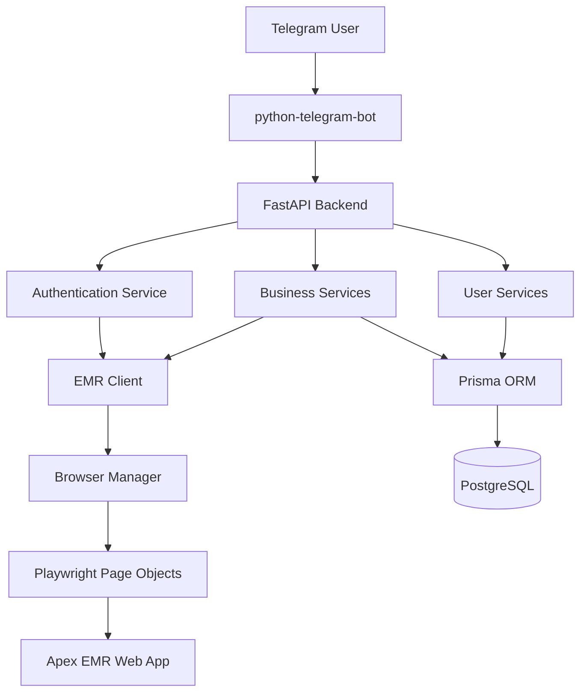

# Afya Apex Companion

**Your AI-powered assistant for the Afya Apex EMR – right inside Telegram.**

Afya Apex Companion is a Telegram bot that gives healthcare professionals secure, conversational access to the Afya Apex Electronic Medical Records system. It automates the browser-based EMR using Playwright, manages user sessions, and exposes key clinical workflows through simple chat commands.

---

## Table of Contents

- [Features](#features)
- [Tech Stack](#tech-stack)
- [Architecture](#architecture)
- [Getting Started](#getting-started)
  - [Prerequisites](#prerequisites)
  - [Installation](#installation)
  - [Configuration](#configuration)
  - [Database Setup](#database-setup)
  - [Running the Application](#running-the-application)
- [Usage](#usage)
- [Project Structure](#project-structure)
- [Roadmap](#roadmap)
- [Contributing](#contributing)
- [License](#license)

---

## Features

- **Telegram-native interface** – all interactions happen through familiar Telegram commands.
- **Automated EMR login & session management** – logs into the Afya Apex web portal, handles dual-login, stores and restores sessions securely.
- **Role-based access control** – admin, doctor, nurse, and read-only roles with approval workflows.
- **Core clinical workflows** – search patients, view demographics, visits, lab results, prescriptions, admissions, billing, and clinical notes.
- **Resilient browser automation** – retry logic, automatic re-login on session expiry, graceful error handling.
- **Real-time observability** – structured logging, request tracing, performance metrics, and health monitoring.
- **Production-ready deployment** – Docker, Docker Compose, CI/CD pipeline, HTTPS, and database backups.

---

## Tech Stack

| Layer                  | Technology                                                                        |
| ---------------------- | --------------------------------------------------------------------------------- |
| **Bot interface**      | [python-telegram-bot](https://github.com/python-telegram-bot/python-telegram-bot) |
| **Backend API**        | [FastAPI](https://fastapi.tiangolo.com/)                                          |
| **Browser automation** | [Playwright](https://playwright.dev/python/)                                      |
| **Database**           | [Supabase](https://supabase.com/) (PostgreSQL)                                    |
| **ORM**                | [Prisma Client Python](https://github.com/RobertCraigie/prisma-client-py)         |
| **Package manager**    | [uv](https://github.com/astral-sh/uv)                                             |
| **Logging**            | `structlog` / standard `logging`                                                  |
| **Containerization**   | Docker, Docker Compose                                                            |

---

## Architecture

